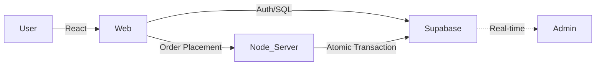

# Nescafe Online Ordering System - IIT Palakkad

A premium, full-stack digital ordering platform designed for the Nescafe outlet at IIT Palakkad. Optimized for speed, reliability, and ease of use.

##  Overview
This system eliminates long queues at the Nescafe outlet by providing a seamless, mobile-first ordering experience. Key features include:

- **Real-time Order Tracking**: Watch your order progress from 'Preparing' to 'Ready'.
- **Dual Payment Architecture**: Currently optimized for **Manual Cash-on-Delivery (COD)** via UPI/Cash, with a dormant **Razorpay integration** that can be reactivated for automated digital payments if needed.
- **Admin Command Center**: Real-time dashboard for staff with the ability to update item prices and availability instantly.
- **Delivery Batching**: Optimized delivery routing by hostel block.
- **Dynamic Menu**: Real-time availability toggles for kitchen staff.

---

##  Tech Stack
- **Frontend**: React (Vite), Framer Motion, Tailwind CSS custom aesthetics.
- **Backend**: Node.js, Express.
- **Database**: PostgreSQL (via Supabase).
- **Authentication**: Supabase Auth (Email validation for students).
- **Payments**: Manual COD (UPI/Cash) is the **active** method. Razorpay SDK is integrated but currently deactivated in the codebase.

---

##  System Architecture
The system uses a decoupled architecture for maximum stability and speed during peak hours.

---

##  Security & Reliability
- **RLS Policies**: Row Level Security ensures data privacy at the database level.
- **Atomic Operations**: PostgreSQL RPC functions ensure inventory consistency and prevent double-spending/overselling.
- **Optimistic UI**: Smooth user experience during network fluctuations.
- **Legacy Support**: Razorpay webhook verification and payment creation logic are preserved in the backend (`index.js`) for future reactivation.

---

##  Key Features Added
- **Direct Price Management**: Managers can now update the prices of menu items directly from the Admin Dashboard.
- **Streamlined Checkout**: Removed taxes, delivery fees, and coupon systems for a zero-friction "One-Click" ordering experience.
- **CORS-Hardened**: Secure whitelist-based API access for production domains.

---

## 🌐 Deployment & Domains

| Layer | Production URL |
|---|---|
| **Frontend** | [nescafeiitpkd.vercel.app](https://nescafeiitpkd.vercel.app) |
| **Backend** | [nescafe-iitpkd.vercel.app](https://nescafe-iitpkd.vercel.app) |

---

##  Author
**Sai Kiran**
IIT Palakkad

