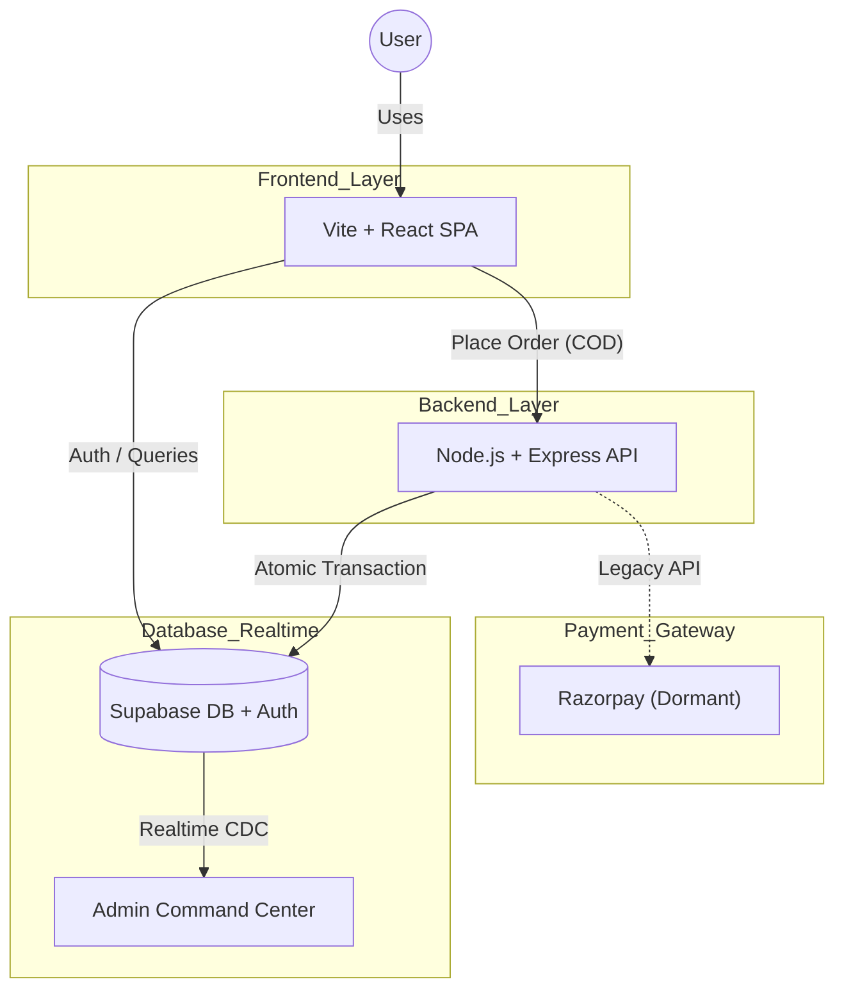
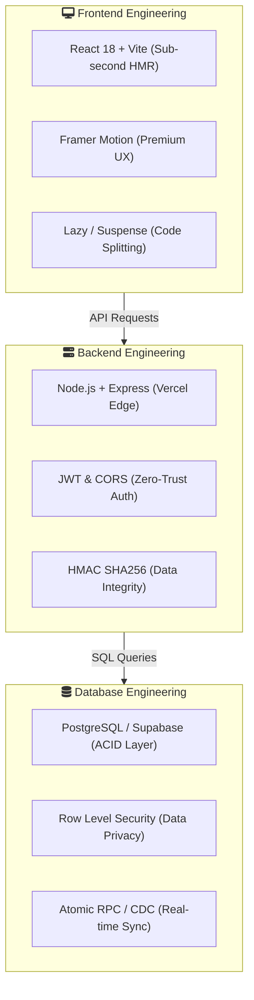
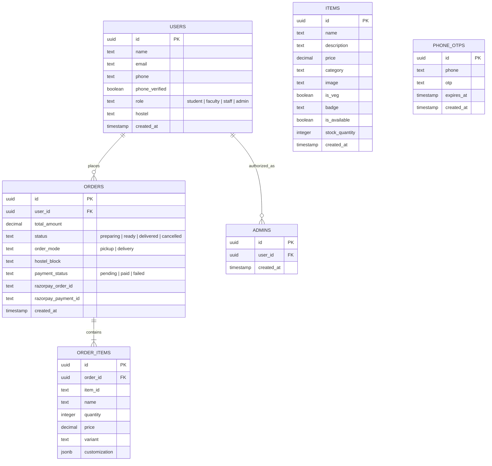
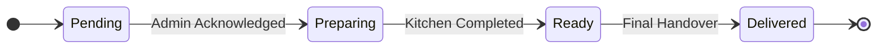

# Nescafe Online Ordering System
### IIT Palakkad — Full-Stack Digital Platform

> A premium ordering platform built for the Nescafe outlet at IIT Palakkad. Designed around three core principles: **atomic consistency**, **real-time synchronization**, and a **zero-friction user experience**.

---

## Table of Contents

1. [System Architecture](#1-system-architecture)
2. [Order & Payment Lifecycle](#2-order--payment-lifecycle)
3. [Database Engineering](#3-database-engineering)
4. [Security Architecture](#4-security-architecture)
5. [Order State Machine](#5-order-state-machine)
6. [Engineering Challenges](#6-engineering-challenges)
7. [Deployment & Domains](#7-deployment--domains)

---

## 1. System Architecture

**Philosophy:** Decoupled · Serverless · Atomic Consistency · Real-Time Enabled

The system separates concerns cleanly across three layers — a React SPA on the frontend, a Node.js/Express API on the backend, and Supabase handling both the database and real-time event streaming. Razorpay is integrated but currently dormant, with COD (UPI/Cash) as the active payment path.



### Stack Breakdown



### ⚡ Engineering Details

| Layer | Key Technologies | Architectural Impact |
|---|---|---|
| **Frontend** | React 18, Vite, Framer Motion | 60FPS animations and sub-100ms TTI |
| **Backend** | Node.js, Express, Vercel | Scalable serverless functions with JWT protection |
| **Database** | PostgreSQL, Supabase, RLS | Atomic inventory guarantees and real-time CDC updates |

---

## 2. Order & Payment Lifecycle

> **Zero-Trust Principle:** The client is never trusted. All price calculations and inventory checks are performed server-side within the atomic transaction — not derived from anything the browser sends.

---

### Active Workflow: Manual COD (UPI / Cash)

The live production flow. A student places an order, the backend re-derives prices independently, and a single atomic RPC call handles both inventory decrement and order creation. The admin is notified in real-time via WebSocket.

```mermaid
%%{init: { 'theme': 'dark', 'themeVariables': { 'primaryColor': '#D4AF37', 'secondaryColor': '#3E2723' } } }%%
sequenceDiagram
    autonumber
    participant U as 👤 Customer
    participant F as ⚡ Frontend
    participant B as 🧠 Backend
    participant DB as 🗄️ Database
    participant A as 🛡️ Admin Dashboard

    rect rgb(40, 40, 40)
        Note over U,A: Phase 1 — Order Placement
        U->>F: Checkout (Select UPI / Cash)
        F->>B: POST /api/place-order-cod
        B->>DB: Server-side Price Re-derivation
        B->>DB: Atomic RPC (create_order_atomic)
    end

    rect rgb(30, 30, 30)
        Note over U,A: Phase 2 — Fulfillment & Real-time Sync
        DB-->>B: Success (Inventory Decremented)
        B-->>F: 200 OK (Show Success Page)
        B->>A: Real-time WebSocket Notification
    end

    rect rgb(40, 40, 40)
        Note over U,A: Phase 3 — Completion
        A->>U: Deliver / Handover Order
        U->>A: Pay via UPI / Cash
        A->>DB: Mark as "Delivered"
    end
```



---

### Legacy Workflow: Automated Razorpay

The original payment integration — dormant but preserved. Razorpay generates a signed order, the student authorizes payment on the frontend, and the backend validates the HMAC signature before committing anything to the database.

```mermaid
%%{init: { 'theme': 'dark', 'themeVariables': { 'primaryColor': '#D4AF37', 'secondaryColor': '#3E2723' } } }%%
sequenceDiagram
    autonumber
    participant U as 👤 Customer
    participant F as ⚡ Frontend
    participant B as 🧠 Backend
    participant R as 💳 Razorpay
    participant DB as 🗄️ Database

    rect rgb(40, 40, 40)
        Note over U,DB: Phase 1 — Order Initialization
        F->>B: POST /create-order
        B->>DB: Fetch secure prices
        B->>R: Generate Order
        R-->>F: order_id
    end

    rect rgb(30, 30, 30)
        Note over U,DB: Phase 2 — Payment Execution
        F->>U: Show Payment Modal
        U->>R: Authorize Payment
        R-->>F: Signature
    end

    rect rgb(40, 40, 40)
        Note over U,DB: Phase 3 — Verification & Commit
        F->>B: POST /verify-payment
        B->>B: HMAC Validation
        B->>DB: Atomic Transaction (RPC)
        B-->>F: 200 OK
    end
```



---

## 3. Database Engineering

> **Design Goals:** ACID compliance, inventory integrity, and real-time synchronization.

---

### Entity Relationship Diagram



---

### Core Tables

**`public.users`**
The central identity table, extending Supabase Auth. It stores student/staff metadata including `hostel` and `phone` details. It is protected by strict RLS policies to ensure privacy.

**`public.items`**
Drives the menu. The `is_available` boolean allows instant toggling without deletion. Stock quantities are indexed for fast reads during peak ordering. Prices are now editable directly through the admin dashboard.

**`public.orders`**
The central record of every transaction. Supports both active payment methods (`cod_upi`, `cod_cash`) and the legacy `razorpay` mode. Status flows through a defined enum: `pending → preparing → ready → delivered → cancelled`. Each order is linked to `auth.users` for per-student order history.

**`public.admins`**
A security-critical lookup table. Users listed here are granted "superuser" permissions across the API and Database. The `is_admin()` SQL function queries this table to authorize destructive mutations or global order visibility.

---

## 4. Security Architecture

> **🛡️ Defense-in-Depth Strategy:** No single point of trust. Every layer independently enforces its constraints.

### Row Level Security

Postgres RLS ensures users can only read and write their own data — enforced at the database level, not the application layer:

```sql
USING (auth.uid() = user_id)
```

### Protection Layers

**Backend Price Re-derivation** — The server independently calculates the total from the database. Whatever the client sends for prices is ignored entirely, making client-side price manipulation structurally impossible.

**JWT Bearer Token Validation** — Every order request requires a valid JWT. Unauthenticated requests are rejected before any business logic executes.

**SERVICE_ROLE Isolation** — Critical database operations (atomic RPCs, admin mutations) use Supabase's service role key, which is never exposed to the public client.

---

## 5. Order State Machine

Every order moves through a defined, linear lifecycle. There are no backward transitions — once an order progresses, it cannot regress.



---

## 6. Engineering Challenges

### ⚠️ Concurrency Control

**The problem:** Two students simultaneously purchasing the last unit of an item. A naive implementation would let both succeed, resulting in negative stock.

**The solution:** A PostgreSQL stored procedure (`create_order_atomic`) wraps the stock check and decrement in a single database transaction. If stock is insufficient at the moment of execution, the transaction rolls back entirely — no partial state, no race condition.

This means the application layer never has to reason about concurrency. The database enforces it.

---

### ⚡ Real-Time Synchronization

**Before:** Short-polling on a timer. High latency (seconds), wasted server resources, poor UX under load.

**After:** Postgres Change Data Capture (CDC) streamed over WebSockets via Supabase Realtime. The admin dashboard receives new order notifications in under 500ms from the moment the transaction commits — with zero polling overhead.

---

## 7. Deployment & Domains

Both the frontend and backend are deployed on Vercel, taking advantage of edge caching for the SPA and serverless function scaling for the API.

| Layer | Production URL |
|---|---|
| **Frontend** | [nescafeiitpkd.vercel.app](https://nescafeiitpkd.vercel.app) |
| **Backend** | [nescafe-iitpkd.vercel.app](https://nescafe-iitpkd.vercel.app) |

---

**Author:** Sai Kiran — IIT Palakkad