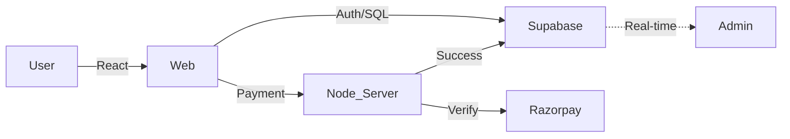

# Nescafe Online Ordering System - IIT Palakkad

A premium, full-stack digital ordering platform designed for the Nescafe outlet at IIT Palakkad. Built with **React**, **Node.js**, **Supabase**, and **Razorpay**.

##  Overview
This system eliminates long queues at the Nescafe outlet by providing a seamless, mobile-first ordering experience. Key features include:

- **Real-time Order Tracking**: Watch your order progress from 'Preparing' to 'Ready'.
- **Secure Payments**: Integrated with Razorpay for UPI, Cards, and Netbanking.
- **Admin Command Center**: Real-time dashboard for staff with delivery batching logic.
- **Delivery Batching**: Optimized delivery routing by hostel block.
- **Dynamic Menu**: Real-time availability toggles for kitchen staff.

---

##  Tech Stack
- **Frontend**: React (Vite), Framer Motion, Tailwind CSS-like custom aesthetics.
- **Backend**: Node.js, Express.
- **Database**: PostgreSQL (via Supabase).
- **Authentication**: Supabase Auth (Email validation for `@smail.iitpkd.ac.in`).
- **Payments**: Razorpay Gateway.

---

##  System Architecture
The system uses a decoupled architecture for maximum stability and speed during peak hours.

---

##  Security & Reliability
- **RLS Policies**: Row Level Security ensures data privacy at the database level.
- **Webhook ID Verification**: Backend verification of Razorpay signatures prevents order manipulation.
- **Optimistic UI**: Smooth user experience during network fluctuations.

---

##  Future Scalability
- **Redis Caching**: To handle frequent menu searches.
- **DB Sharding**: Scalability for 10,000+ daily orders across multiple outlets.

---

---

## 🌐 Deployment & Domains

| Layer | Production URL |
|---|---|
| **Frontend** | [nescafeiitpkd.vercel.app](https://nescafeiitpkd.vercel.app) |
| **Backend** | [nescafe-iitpkd.vercel.app](https://nescafe-iitpkd.vercel.app) |

> [!IMPORTANT]
> All Supabase traffic is proxied through the backend at `/supabase` to ensure connectivity across all Indian mobile networks.

---

##  Author
**Sai Kiran**
IIT Palakkad

