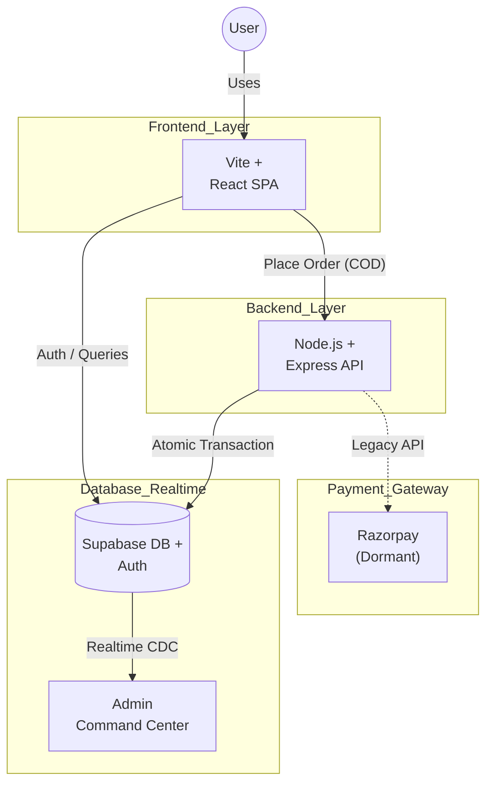
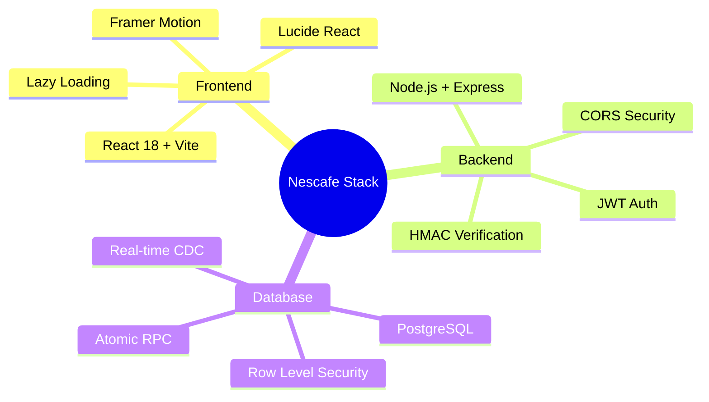
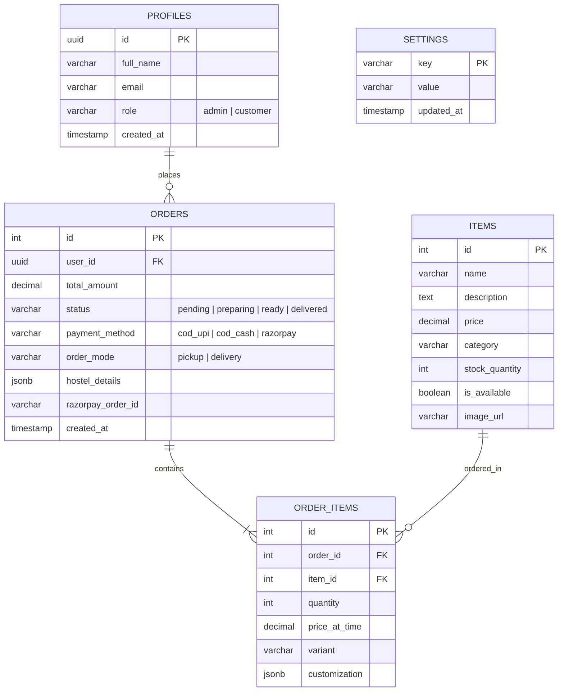
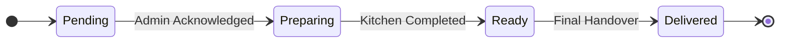

# Nescafe Online Ordering System - IIT Palakkad

> [!IMPORTANT]
> A premium, full-stack digital ordering platform designed for the Nescafe outlet at IIT Palakkad. Built with a focus on real-time synchronization, atomic consistency, and a zero-friction user experience.

---

# 1. System Architecture

### Architecture Philosophy
> Decoupled • Serverless • Atomic Consistency • Real-Time Enabled



---

## Stack Breakdown



> [!tip] Frontend Engineering
- **React 18** with **Vite** for sub-second hot reloads.
- **Framer Motion** for premium micro-animations.
- **Lucide React** for consistent iconography.
- **React Lazy / Suspense** for aggressive code splitting and performance.

> [!success] Backend Engineering
- **Node.js + Express** hosted on Vercel.
- **JWT Middleware** for secure route protection.
- **HMAC-SHA256 Verification** (for legacy Razorpay support).
- **CORS Whitelisting** for production domain security.

> [!warning] Database Layer
- **PostgreSQL** (via Supabase) with **Row Level Security (RLS)**.
- **Change Data Capture (CDC)** for real-time kitchen notifications.
- **pgSQL Atomic Procedures (RPC)** to prevent inventory overselling.

---

# 2. Order & Payment Lifecycle

> [!danger] Zero-Trust Principle  
> The client is never trusted. All price calculations and inventory checks happen server-side during the atomic transaction.

---

## Active Workflow: Manual COD (UPI/Cash)

```mermaid
%%{init: { 'theme': 'dark', 'themeVariables': { 'primaryColor': '#D4AF37', 'secondaryColor': '#3E2723' } } }%%
sequenceDiagram
    autonumber
    participant U as 👤 Customer
    participant F as ⚡ Frontend
    participant B as 🧠 Backend
    participant DB as 🗄️ Database
    participant A as 🛡️ Admin Dashboard

    rect rgb(40, 40, 40)
        Note over U,A: Phase 1: Order Placement
        U->>F: Checkout (Select UPI/Cash)
        F->>B: POST /api/place-order-cod
        B->>DB: Server-side Price Re-derivation
        B->>DB: Atomic RPC (create_order_atomic)
    end

    rect rgb(30, 30, 30)
        Note over U,A: Phase 2: Fulfillment & Real-time
        DB-->>B: Success (Inventory Decremented)
        B-->>F: 200 OK (Show Success Page)
        B->>A: Real-time WebSocket Notification
    end

    rect rgb(40, 40, 40)
        Note over U,A: Phase 3: Completion
        A->>U: Deliver/Handover Order
        U->>A: Pay via UPI/Cash
        A->>DB: Mark as "Delivered"
    end
```



---

## Legacy Workflow: Automated Razorpay

```mermaid
%%{init: { 'theme': 'dark', 'themeVariables': { 'primaryColor': '#D4AF37', 'secondaryColor': '#3E2723' } } }%%
sequenceDiagram
    autonumber
    participant U as 👤 Customer
    participant F as ⚡ Frontend
    participant B as 🧠 Backend
    participant R as 💳 Razorpay
    participant DB as 🗄️ Database

    rect rgb(40, 40, 40)
        Note over U,DB: Phase 1: Order Initialization
        F->>B: POST /create-order
        B->>DB: Fetch secure prices
        B->>R: Generate Order
        R-->>F: order_id
    end

    rect rgb(30, 30, 30)
        Note over U,DB: Phase 2: Payment Execution
        F->>U: Show Modal
        U->>R: Authorize
        R-->>F: signature
    end

    rect rgb(40, 40, 40)
        Note over U,DB: Phase 3: Verification & Transaction
        F->>B: POST /verify-payment
        B->>B: HMAC Validation
        B->>DB: Atomic Transaction (RPC)
        B-->>F: 200 OK
    end
```



---

# 3. Database Engineering

> [!abstract] Design Goals  
> ACID compliance, inventory integrity, and real-time synchronization.

---

## Entity Relationship Diagram



---

## Core Tables

#### `public.items`
- **Availability Toggle**: Instant menu updates.
- **Stock Tracking**: Indexed quantity fields.
- **Dynamic Pricing**: Now editable directly by admins.

#### `public.orders`
- **Payment Modes**: Supports `cod_upi` and `cod_cash`.
- **Status Enum**: `pending`, `preparing`, `ready`, `delivered`, `cancelled`.
- **Foreign Keys**: Linked to `auth.users` for history tracking.

---

# 4. Security Architecture

> [!danger] Defense-in-Depth Strategy

## Row Level Security Policy
```sql
USING (auth.uid() = user_id)
```

## Protection Layers
- **Backend Price Re-derivation**: Prevents client-side price manipulation.
- **JWT Bearer Token Validation**: Ensures only authenticated students can order.
- **SERVICE_ROLE Isolation**: Critical database operations are shielded from public access.

---

# 5. Order State Machine


---

# 6. Engineering Challenges

### Concurrency Control
> [!danger] Risk  
> Two users purchasing the last available item simultaneously.

> [!success] Atomic Stored Procedure
We use a PostgreSQL RPC function to ensure that inventory is only decremented if stock is sufficient, all within a single database transaction.

### Real-Time Synchronization
Before: Polling with high latency and server overhead.  
After: **Postgres CDC (Change Data Capture)** via WebSockets for <500ms latency on order notifications.

---

# 7. Deployment & Domains

| Layer | Production URL |
|---|---|
| **Frontend** | [nescafeiitpkd.vercel.app](https://nescafeiitpkd.vercel.app) |
| **Backend** | [nescafe-iitpkd.vercel.app](https://nescafe-iitpkd.vercel.app) |

---

## Author
**Sai Kiran**  
IIT Palakkad
